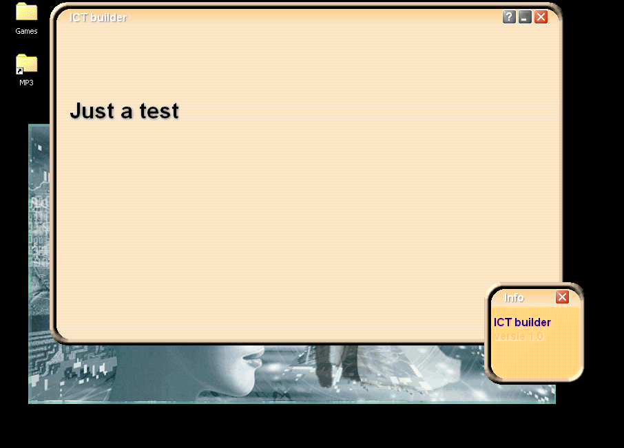

## Drop Shadow

### Description

I wanted to do something with special FX, like real dropshadow FX like in Photoshop or PaintShopPro.

Nobody could answer my questions at www.vbforums.com, only "Cyborg" gave me some usefuladvice about the blending parts. (tx...)

Now, the GFX part has already been coded and works fine & fast. Very fast! Very very fast!!!

SIMPLE CODE!!! NO DIRECTX!!! TRANSPARENCY!!! TRANSLUCENCY!!!

This is a preliminary project with goals to maintain a company's ICT infrastructure.

It also includes: hover buttons with special FX (in software, very fast!), SysTray handling, irregular forms, texturing, ...

SMALL CODE!!!
 
### More Info
 
Perform transparent (!) dropshadows on any given text (Font, Bold, ForeColor, ShadowColor, ShadowDepth, X & Y) on any given hDC.

It doesn't use DirectX.

It's very very fast! It runs even very fast on a Pentium III @450MHz... (Thanks to the DIB section algorithms)

It uses some code from VBAccelerator.com (thank you!)

Why should you include .GIF & .JPG if you can do it in code?

The SysTray event trigger is not yet 100% when a child window is opened. (= small modification)

             |
---                |---
**Submitted On**   |2003-11-26 21:49:42
**By**             |[Mad Compie](https://github.com/Planet-Source-Code/PSCIndex/blob/master/ByAuthor/mad-compie.md)
**Level**          |Advanced
**User Rating**    |5.0 (45 globes from 9 users)
**Compatibility**  |VB 6\.0
**Category**       |[Graphics](https://github.com/Planet-Source-Code/PSCIndex/blob/master/ByCategory/graphics__1-46.md)
**World**          |[Visual Basic](https://github.com/Planet-Source-Code/PSCIndex/blob/master/ByWorld/visual-basic.md)
**Archive File**   |[Drop\_Shado16773211282003\.zip](https://github.com/Planet-Source-Code/mad-compie-drop-shadow__1-50176/archive/master.zip)

